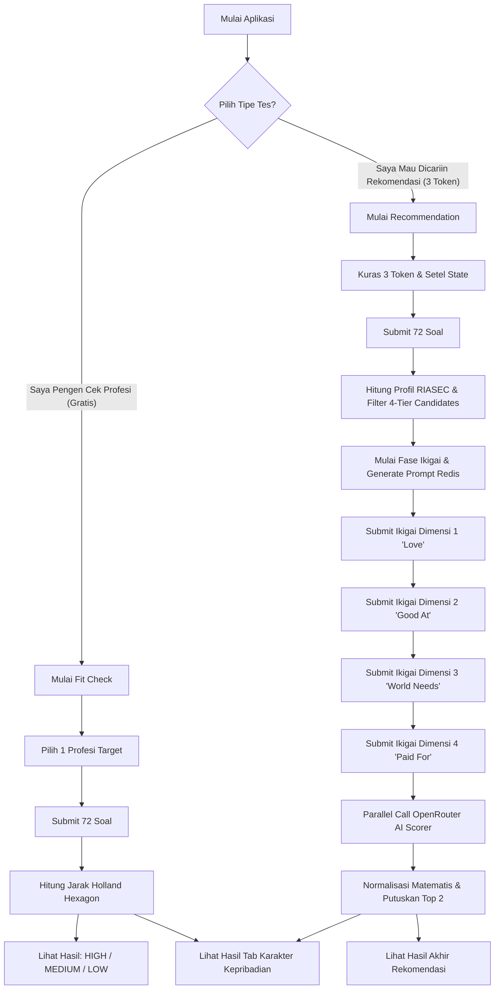

# Use Case System: Kenali Diri – Career Profile (RIASEC & Ikigai)

Dokumen ini memetakan _Use Case_ atau skenario penggunaan sistem utama dari backend AI Rextra berdasarkan 4 brief teknikal:

1. Pengerjaan FastAPI — Tes Profil Karier (RIASEC)
2. Penugasan Backend — Part 3 (Final Result)
3. Penugasan Backend — Tes Ikigai (Part 1)
4. Penugasan Backend — Tes Ikigai (Part 2)

---

## 👨‍💼 Actor (Aktor Sistem)

Sistem ini melibatkan 1 Aktor Utama dan 2 Aktor Pasif (System/Services):

1. **User (Klien Aplikasi Flutter)**: Aktor yang menginisiasi tes RIASEC & Ikigai melalui antarmuka mobile apps Kenali Diri. User diasumsikan sudah tervalidasi via _JWT Middleware_.
2. **PostgreSQL Database (System)**: Aktor pasif yang menyimpan data master profesi, log transaksi _Wallet Token_, rekam jejak _Sessions_, hasil _RIASEC_, dan _Ikigai Responses_.
3. **OpenRouter AI (System)**: Aktor pasif Generative AI (Google Gemini via OpenRouter) yang memproses penalaran dimensi dan skoring profil kandidat terhadap user.
4. **Redis Cache (System)**: Aktor pasif penyimpan _Rate Limiting_ dan _Generative Content_ (Prompt AI) yang bersifat sementara (opsi profesi).

---

## 🎯 Daftar Use Case Utama

Sistem Tes Profil Karier dibagi menjadi **Dua (2) Siklus Perjalanan Utama**, yang membungkus Use Cases berikut:

### SIKLUS A: RECOMMENDATION FLOW (Tujuan: Rekomendasi Profesi)

Use Case ini ditujukan ketika _User_ ingin mendapatkan rekomendasi 2 Profesi paling cocok berdasarkan profil Kepribadian (RIASEC) dan kondisi irisan hidup/karirnya (Ikigai).

#### **UC-A1: Menginisiasi Sesi (Start Recommendation)**

- **Actor:** User
- **Pre-condition:** User berhasil _login_ dan memiliki setidaknya **3 Token** pada akunnya.
- **Main Flow:**
  1.  User menekan tombol "Mulai Tes Rekomendasi".
  2.  Sistem (API) memeriksa saldo Token User di Database.
  3.  Sistem (API) memotong 3 Token dan menyimpan ke tabel Transaksi Ledger.
  4.  Sistem membuat Rekaman `career_profile_sessions` baru dengan status `started` bernilai "RECOMMENDATION".
  5.  Sistem mengembalikan URL UUID token sesi ke UI.
- **Alternative Flow (Token Kurang):** Sistem menolak inisiasi, memberikan status `403 Forbidden` kepada UI (Token kurang). Transaksi Database di-_rollback_.

#### **UC-A2: Menjawab Asesmen RIASEC**

- **Actor:** User
- **Pre-condition:** User telah memiliki _Session Token_ dari _UC-A1_.
- **Main Flow:**
  1.  User diberikan 72 Soal tipe _Likert-scale_ dan mengirim 72 jawaban sekaligus.
  2.  Sistem mengakumulasi nilai untuk tipe **R, I, A, S, E,** dan **C**.
  3.  Sistem menghitung tipe profil (Single, Dual, Triple) dan mencari _Candidate Professions_ berdasarkan _4-Tier Expansion_ (Exact Match, Congruent, Subset, Dominant).
  4.  Sistem membungkus 4 Kandidat Teratas lalu mengakhiri fase RIASEC dan menyimpannya.
- **Alternative Flow (Anti-Cheat / Invalid Profile):** Jika User mengetik skor rata yang sama ke semua pertanyaan (misal selalu jawab 5 pada seluruh 72 soal), Algoritma `Split-Path Strategy` gagal membedakan profil. Sistem merespons Error 422 dan meminta instropeksi.

#### **UC-A3: Mengakses Opsi Tahap Ikigai**

- **Actor:** User, OpenRouter AI, Redis
- **Pre-condition:** Status _Session_ sudah mencapai status (RIASEC_COMPLETED) dan tes memiliki kandidat profesi (hasil _UC-A2_).
- **Main Flow:**
  1.  User memencet tombol "Mulai Tahap 2 (Ikigai)".
  2.  Sistem mengambil _Top Ranked Candidate Professions_ dari Database.
  3.  Sistem mengirimkan _Request_ ke _OpenRouter AI_ untuk meminta AI "Mendeskripsikan profesi bagi user yang sangat personal berbasis RIASEC-nya".
  4.  Sistem mencatat hasil AI Narasi ke Redis Cache selama (2 jam).
  5.  Sistem memutar balikkan narasi untuk 4 Dimensi Ikigai (Cinta, Keahlian, Dampak, Finansial) kepada Layar Handphone User.

#### **UC-A4: Submit Opsi per Dimensi Ikigai (Iterasi 3x)**

- **Actor:** User
- **Pre-condition:** System telah sukses menjalankan _UC-A3_.
- **Main Flow (Dimensi 1 s/d 3):**
  1.  Layar Handphone User menampilkan satu Dimensi (contoh: "Apa yang membuatmu merasa dibayar secara pantas?").
  2.  Tampil 3 Pilihan Profesi hasil AI + 1 Kolom Bebas.
  3.  User hanya mengetik di Kolom Bebas (atau menge-klik pilihan Profesi).
  4.  Sistem menerima _submit_ via Endpoint (misal POST dimensi `what_you_love`).
  5.  Sistem menandai kolom Record Response di Database dan belum melakukan _AI Scoring_. UI User lanjut ke next Page.
- **Alternative Flow (Duplikasi Pengerjaan):** Jika Request dimensi yang sama mendadak ditembak dua kali, Backend menolak.

#### **UC-A5: Submit Dimensi Keempat Ikigai & Finalisasi AI (Final)**

- **Actor:** User, OpenRouter AI
- **Pre-condition:** System telah merekam 3 submit Dimensi sebelumnya dan User sekarang berada di akhir fase.
- **Main Flow:**
  1.  User men-submit Dimensi Terakhir (Misal: "Kebutuhan Dunia").
  2.  Sistem menangkap Request tersebut dan men-Trigger `Background Processing` (Sistem mengunci status sesi menjadi status _ONGOING_SCORING_).
  3.  Sistem langsung menyebarkan 4 _Asynchronous Calls_ paralel AI ke OpenRouter untuk mengevaluasi Teks Ketikan Bebas _Reasoning User_ vs Deskripsi Profesi.
  4.  Setelah Scoring AI (dari skala 0-5) sukses terkumpul beserta rasionalnya, Sistem Menjumlahkan Hasil (Skor AI 15%, Click Rate 10%, RIASEC Base).
  5.  Sistem memutuskan Top 2 Profesi dan Menyimpan Final Report ke Database. Session diupdate ke _COMPLETED_.

#### **UC-A6: Melihat Laporan Rekomendasi 2 Teratas**

- **Actor:** User
- **Pre-condition:** _Session Status_ harus sudah bernilai _COMPLETED_.
- **Main Flow:**
  1.  User menekan tab "Hasil Rekomendasi Profesi".
  2.  Sistem mengambil dari tabel Report.
  3.  UI Menampilkan narasi personal untuk 2 pekerjaan rekomendasi utama dan ringkasan AI Skoring Ikigai.

---

### SIKLUS B: FIT-CHECK FLOW (Tujuan: Kecocokan Profesi Target)

Use Case ini ditujukan ketika User **SUDAH PUNYA** profesi impian/profesi target di kepalanya, dan cuma mau TAHU apakah kepribadian (RIASEC) miliknya secara objektif sejalan dengan tipe Profesi Target itu, tanpa masuk tahap pendalaman hidup ikigai.

#### **UC-B1: Menginisiasi Cek Kecocokan**

- **Actor:** User
- **Pre-condition:** User memilih sebuah profesi di "Katalog Profesi" UI App. **Tidak ada biaya token.**
- **Main Flow:**
  1.  User mengirim `Target_Profession_ID` ke Backend.
  2.  Sistem membuat Session Tester dengan mode "FIT_CHECK".

#### **UC-B2: Menjawab Asesmen RIASEC - Shortcut**

- **Actor:** User
- **Pre-condition:** Mode FIT_CHECK telah inisiasi.
- **Main Flow:**
  1.  User dikerahkan ke _72 Soal RIASEC_ dan mensubmit.
  2.  Sistem menghitung tipe profil R, I, A, S, E, C User.
  3.  Namun HANYA UNTUK FIT CHECK: Setelah menemukan Holland Code User, Sistem tidak membungkus "Kandidat" lagi (karena tidak dipakai), melainkan Sistem LANGSUNG membandingkan Algoritma Hexagon _Jarak Holland Code User_ terhadap _Holland Code Target_Profession_ID_.
  4.  Status Tes ini Langsung di-_set_ `COMPLETED` detik itu juga (Sistem _shortcut_ tidak melewatin fase Ikigai).

#### **UC-B3: Melihat Laporan Kesesuaian Holland-Hexagon**

- **Actor:** User
- **Pre-condition:** Sesi _Fit-Check_ masuk `COMPLETED`.
- **Main Flow:**
  1.  User menekan tab "Lihat Match (Kecocokan)".
  2.  Sistem mengembalikan label Match (_HIGH / MEDIUM / LOW_), lalu memberikan deskripsi _Why?_ (misalnya User _Realistis_ versus Profesi Target yang berkarakter _Sosial/Artistis_ memicu kecocokan jarak Oposisi/Berlawanan — _Low_).

---

### SIKLUS C: TAB PERSPECTIVES SHARED (Karakter)

Tab Kepribadian murni dari _assessment_ (Tanpa terpengaruh jenis tes).

#### **UC-C1: Melihat Tab Kepribadian Pribadi (Personality Tab)**

- **Actor:** User
- **Pre-condition:** Salah Satu _Session Status_ minimal berstatus `RIASEC_COMPLETED` dari _Flow A atau Flow B_.
- **Main Flow:**
  1.  User menekan tab "Kepribadian".
  2.  Sistem mengembalikan angka 6 parameter Grafik Radar RIASEC.
  3.  Sistem mengembalikan _Strengths, Weaknesses, Work Environments,_ dan Narasi Tipe Karakter dasar pribadi pengguna.

---

## 🧭 Flowchart Visual Naratif

